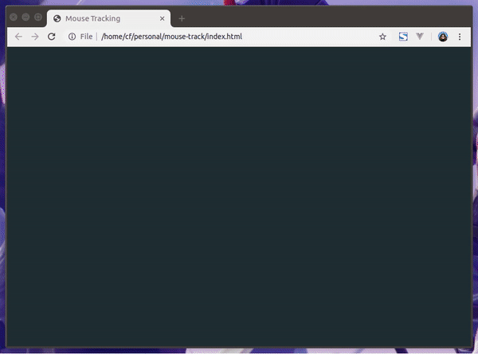

Particle Mouse Tracking
=======================
Using canvas to track the mouse and apply animations based on mouse position. Special thanks to Arnelle Balane for help in ironing out the animation bugs.

## References
- [How to draw animated circles in HTML5 canvas](https://javascript.tutorials24x7.com/blog/how-to-draw-animated-circles-in-html5-canvas)